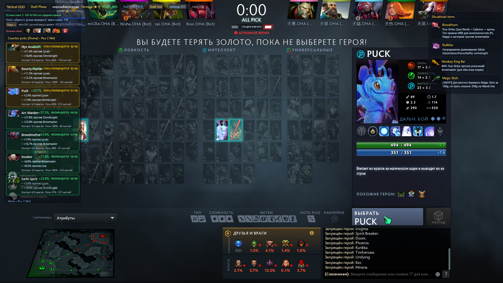

# LaneTheory

Локальный игровой overlay для Dota 2. Он получает разрешённые данные через Game State Integration (GSI), показывает рекомендации по линии и драфту, таймеры и ситуативные предметы поверх игры.

LaneTheory не читает память Dota, не внедряется в процесс и не отправляет игровые действия. Vision работает по одному снимку окна только после явного F10.

## Драфт-анализ



## Возможности

### Роль, мета и сборки

- В F8 выбирается **роль перед поиском**. Она сохраняется и применяется в начале каждой новой игры; F5 меняет роль только до конца текущего матча. Роль больше не угадывается по типичной позиции выбранного героя или старому профилю.
- Meta-герои, counter picks и статистика учитывают выбранный рейтинговый диапазон OpenDota. Частично доступные ранговые данные используются с fallback к общей статистике, вместо показа фиктивных 50%.
- Источник билдов переключается между агрегированной статистикой OpenDota и Dota 2 Pro Tracker: для D2PT открывается role-specific страница героя.
- Сборка разбита на Start / Early / Mid / Late; есть ситуационные контр-предметы, причины их рекомендации и подсказка Magic Stick / Magic Wand / skip для линии.

### Драфт

- Counter picks ранжируются по суммарному весу матчапов, пригодности к выбранной роли, повторяющимся сильным match-up и составу союзников. Синергия союзников учитывается слабее прямых контрпиков.
- В карточках рекомендации видны вклад против отдельных героев, покрытие состава, роль и объём матчей.
- Ручной picker позволяет добавлять и убирать союзников и соперников прямо во время драфта. Состояние ручного драфта очищается при новом `matchid` и при выходе в меню — пики прошлой игры не переносятся.
- Когда GSI в конкретном режиме действительно отдаёт пики, они имеют приоритет над ручным вводом. В обычном All Pick Valve, как правило, не раскрывает в GSI вражеские пики.

### Vision для драфта

- F10 делает **один** локальный снимок карточек драфта: нет постоянного сканирования, записи видео или нагрузки в фоне.
- При первом переходе в Strategy Time LaneTheory сам делает тот же единичный снимок: в этот момент видны все десять карточек, поэтому F10 остаётся только ручным повтором.
- Карточки распознаются по perceptual hash с допустимым расстоянием и margin до следующего кандидата. Пустые/тёмные слоты отдельно отсеиваются, чтобы не превращаться в случайных героев.
- F10 не открывает дополнительные элементы поверх драфта: он только сохраняет десять реальных кропов карточек. После завершённой игры появляется отдельная post-game проверка с этими изображениями; игрок выбирает карточку, видит её перед глазами и подписывает настоящего героя. Так создаётся локальный вариант портрета для следующего F10.
- Vision не обучается на собственных догадках. В кэш попадают только явно подтверждённые пользователем карточки; «Сбросить обучение» удаляет только такие локальные варианты.
- Последний кадр доступен для диагностики как `cache/vision_last_scan.png`; базовые и обученные портреты остаются локальными и не попадают в GitHub.

### Игра и таймеры

- Таймеры рун, лотосов, катапульт, нейтральных предметов, Терзателя, стаков и отводов выводятся слева по центру, чтобы не закрывать пик героев.
- F9 открывает таймер Roshan и выбор стороны `Our / Enemy`.
- Трекер ключевых ультимейтов работает для всех выбранных соперников: уровень R I / II / III меняет cooldown таймера.
- TTS опционален, с debounce: одна подсказка не повторяется каждые несколько секунд.

## Управление

| Клавиша | Действие |
| --- | --- |
| F5 | Временно сменить роль текущего матча |
| F6 | Оставить только важные уведомления |
| F7 | Скрыть или вернуть весь overlay |
| F8 | Настройки, сохранённая роль и параметры источников данных |
| F9 | Таймер Roshan и сторона убийства |
| F10 | Одноразово распознать карточки на экране драфта |

## Запуск

1. Установить Dota 2 и запустить `run.bat`.
2. В Steam → Dota 2 → Properties → Launch Options добавить ровно `-gamestateintegration`.
3. Первый запуск создаст `gamestate_integration_lanetheory.cfg` в каталоге Dota 2. Если игра уже открыта, полностью перезапустить её.
4. Для свежей статистики OpenDota нужен доступ к API. При недоступности сети overlay продолжает работать с локальными данными.

`-gamestateintegration` обязателен: с марта 2022 Valve отключила GSI по умолчанию. Файл `.cfg` сообщает Dota, **куда** посылать данные, а launch option включает сам механизм. Не путать с неполным `-gameintegration` — он не является нужным параметром.

## Данные и обновления

В репозитории лежит минимальный bootstrap-набор героев, предметов и hero stats, который вшивается в бинарник. При запуске приложение проверяет актуальность hero stats, способностей, cooldown-данных и item schema через OpenDota с ограниченным таймаутом. Ошибка сети или некорректный ответ не обнуляет данные: остаётся последний валидный кэш.

При старте рядом с `LaneTheory.exe` создаётся и обновляется `LaneTheory.ypk`. Это versioned offline snapshot героев, предметов, rank stats и данных способностей. При недоступности API следующий запуск использует `.ypk` раньше сети и локального кэша. После патча свежий `.ypk` можно получить из GitHub Actions, не дожидаясь ручного запроса к OpenDota.

## Ограничения

- Стандартный player-GSI не гарантирует пики соперников в рейтинговом All Pick. Для этого есть ручной picker и F10 Vision; `allplayers` доступен только в режимах, где его раскрывает сама Dota.
- Во время матча ошибочный пик можно исправить через `F8 → Исправить пики`; ручная правка становится источником истины для анализа до конца этого матча.
- Vision предназначен как быстрый ввод, а не как источник безошибочных данных: результаты нужно сверять и при необходимости подтверждать через picker. Локальное обучение постепенно улучшает именно этот компьютер и этот HUD.
- Статистика и item schema зависят от доступности публичных источников и их текущего патча. При недоступности сети используется валидный offline-кэш, а не случайные значения.

## Разработка

```powershell
cargo build --release
```

GitHub Actions собирает Windows-артефакт для каждого изменения в `main` и для тегов релиза. CI использует Rust-aware cache; число compile jobs не фиксируется и выбирается самим runner. Артефакт содержит `LaneTheory.exe` и проверенный `LaneTheory.ypk` рядом с ним.

Workflow **Refresh LaneTheory data pack** запускается вручную в GitHub Actions или по понедельникам. Он загружает публичные данные заново, отвергает неполный pack и публикует `LaneTheory-data-pack` как отдельный artifact. Локальный `.ypk`, Vision-кэш и настройки пользователя не отправляются в GitHub.

## Недавние изменения

- Добавлен offline data pack `.ypk` и weekly workflow его обновления; GitHub build публикует exe, `.ypk`, `run.bat` и README одним Windows-артефактом.
- Обновлён transport OpenDota item schema: ответ разбирается из raw body с `Accept-Encoding: identity`, а предыдущий кэш сохраняется при ошибке.
- Добавлены устойчивые границы матча по `matchid`, очистка ручного драфта, новая сохранённая роль и match-local F5 override.
- Vision получил pHash, shift-search, отсев пустых карточек, debug screenshot и supervised local variant cache с post-game подтверждением по реальным кропам.
- Counter-pick анализ делает до пяти matchup-запросов параллельно с лимитом 3 секунды на каждый и общим guard в 12 секунд: недоступный публичный API больше не оставляет HUD в бесконечном loading-state и не влияет на Vision.
